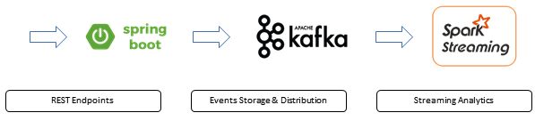

## Overview
Sample application to showcase streaming data analytics with City Of Chicago Taxi Trips dataset using Spark Structured Streaming, Kafka and Spring Boot.

Below is the basic architecture.



* The application exposes two REST endpoints to collect trip start and trip end events
* The events are published to Kafka topics
* Spark Streaming pulls the events from Kafka topics and performs rolling aggegrates on the incoming events
* The mock events are posted on to the REST endpoints using Python scripts

## City of Chicago Taxi Trips Dataset
https://data.cityofchicago.org/Transportation/Taxi-Trips-Dashboard/spcw-brbq
https://data.cityofchicago.org/Transportation/Taxi-Trips/wrvz-psew

## Software
|Software|Version|
|--------|--------|
|Java|1.8.0_131|
|Kafka|2.11-0.11.0.0|
|ZooKeeper|3.4.10|
|Spark|2.1.1, Using Scala version 2.11.8|
|Python|3.5.1|
|pip|9.0.1|

Installations tips: https://www.digitalocean.com/community/tutorials/how-to-install-apache-kafka-on-ubuntu-14-04

## Build The Project
#### Code Checkout
```bash
$ git clone https://github.com/codspire/chicago-taxi-trips-streaming-analysis.git
$ cd chicago-taxi-trips-streaming-analysis/
```
#### Update Properties
Update the `bootstrap` property with your Kafka `host:port` in the below files:
* taxitrips-kafka-sub/src/main/resources/application.yml
* taxitrips-rest/src/main/resources/application.yml

#### Build
```bash
$ chmod +x mvnw
$ ./mvnw clean package
```
## Start The Application
cd to the root folder (i.e. chicago-taxi-trips-streaming-analysis)

#### Start REST Services
```bash
java -jar taxitrips-rest/target/taxitrips-rest-0.0.1-SNAPSHOT.jar
```
#### Start Kafka Consumer (Optional)
Optinal step, this will print the Kafka messages to console
```bash
java -jar taxitrips-kafka-sub/target/taxitrips-kafka-sub-0.0.1-SNAPSHOT.jar
```
## Publish Mock Events

cd to `chicago-taxi-trips-streaming-analysis/taxitrips-events-generator/src/main/resources/python`

Note:
* Replace <hostname> placeholder with your hostname
* Use --datafile to provide mock data (available under resources folder)
* Use --delay to specify seconds wait time between REST request submission

#### Trip Start Mock Events
```bash
$ python tripstart-events2.py \
--endpoint http://<hostname>:9090/tripstart \
--datafile ../test-data-v2-aa.csv \
--delay 0.2
```
#### Trip End Mock Events
```bash
$ python tripend-events2.py \
--endpoint http://<hostname>:9090/tripend \
--datafile ../test-data-v2-aa.csv \
--delay 0.2
```
## Start Spark Streaming Query
cd to `chicago-taxi-trips-streaming-analysis/taxitrips-events-generator/src/main/resources/python`
```bash
$ spark-submit --packages org.apache.spark:spark-core_2.11:1.5.2,\
org.apache.spark:spark-streaming_2.11:1.5.2,\
org.apache.spark:spark-sql-kafka-0-10_2.11:2.1.0,\
org.apache.spark:spark-streaming-kafka_2.11:1.5.2,\
org.apache.kafka:kafka_2.11:0.11.0.0,\
org.apache.kafka:kafka-clients:0.11.0.0 \
./spark-streaming-analytics.py --kafka_servers localhost:9092
```
#### Spark Streaming Query Results
Spark console should show the SQL results for events stream. The current query checks for number of trips started and ended every 30 secs grouped by Cab Company.

Sample Outputs:
```bash
+---------------------------------------------+---------------------------------+-----+----------------+
|window                                       |companyName                      |count|eventType       |
+---------------------------------------------+---------------------------------+-----+----------------+
|[2017-07-15 20:24:30.0,2017-07-15 20:25:00.0]|Top Cab Affiliation              |3    |tripstart events|
|[2017-07-15 20:24:30.0,2017-07-15 20:25:00.0]|Northwest Management LLC         |3    |tripstart events|
|[2017-07-15 20:24:30.0,2017-07-15 20:25:00.0]|Dispatch Taxi Affiliation        |25   |tripstart events|
|[2017-07-15 20:24:30.0,2017-07-15 20:25:00.0]|KOAM Taxi Association            |7    |tripstart events|
|[2017-07-15 20:24:30.0,2017-07-15 20:25:00.0]|Taxi Affiliation Services        |40   |tripstart events|
|[2017-07-15 20:24:30.0,2017-07-15 20:25:00.0]|Choice Taxi Association          |11   |tripstart events|
|[2017-07-15 20:24:00.0,2017-07-15 20:24:30.0]|Northwest Management LLC         |12   |tripstart events|
|[2017-07-15 20:24:00.0,2017-07-15 20:24:30.0]|Choice Taxi Association          |21   |tripstart events|
|[2017-07-15 20:24:00.0,2017-07-15 20:24:30.0]|KOAM Taxi Association            |9    |tripstart events|
|[2017-07-15 20:24:00.0,2017-07-15 20:24:30.0]|Blue Ribbon Taxi Association Inc.|4    |tripstart events|
+---------------------------------------------+---------------------------------+-----+----------------+
only showing top 10 rows
```

```bash
+---------------------------------------------+---------------------------------+-----+--------------+
|window                                       |companyName                      |count|eventType     |
+---------------------------------------------+---------------------------------+-----+--------------+
|[2017-07-15 20:24:30.0,2017-07-15 20:25:00.0]|Top Cab Affiliation              |2    |tripend events|
|[2017-07-15 20:24:30.0,2017-07-15 20:25:00.0]|5129 - Mengisti Taxi             |1    |tripend events|
|[2017-07-15 20:24:30.0,2017-07-15 20:25:00.0]|Northwest Management LLC         |3    |tripend events|
|[2017-07-15 20:24:30.0,2017-07-15 20:25:00.0]|Dispatch Taxi Affiliation        |16   |tripend events|
|[2017-07-15 20:24:30.0,2017-07-15 20:25:00.0]|Blue Ribbon Taxi Association Inc.|2    |tripend events|
|[2017-07-15 20:24:30.0,2017-07-15 20:25:00.0]|KOAM Taxi Association            |2    |tripend events|
|[2017-07-15 20:24:30.0,2017-07-15 20:25:00.0]|Taxi Affiliation Services        |22   |tripend events|
|[2017-07-15 20:24:30.0,2017-07-15 20:25:00.0]|3201 - C&D Cab Co Inc            |1    |tripend events|
|[2017-07-15 20:24:30.0,2017-07-15 20:25:00.0]|Choice Taxi Association          |10   |tripend events|
|[2017-07-15 20:24:00.0,2017-07-15 20:24:30.0]|Northwest Management LLC         |4    |tripend events|
+---------------------------------------------+---------------------------------+-----+--------------+
only showing top 10 rows
```
